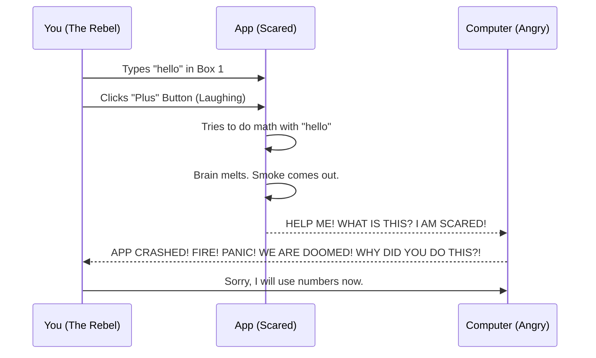
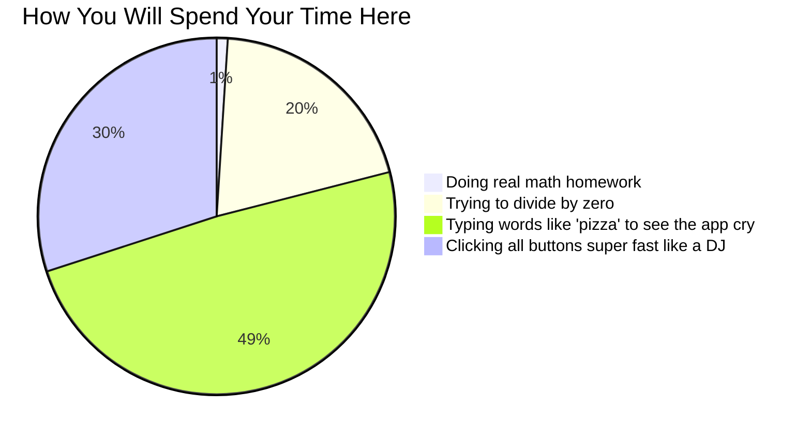

# 🧮 The Super Duper Mega Ultra Simple_Calculator 9000 🚀
> *"Because math is hard, and counting on your fingers only works up to 10... or 20 if you take your shoes off. After that, you need a computer. Or a very smart dog."*


-blue)


Welcome to the **Simple_Calculator**! 

Are you tired of doing math in your head? 
Does thinking about numbers make your brain feel like wet spaghetti? 
Have you ever wondered what `2 + 2` is but were too shy to ask a smart person? 
Do you cry when someone says "multiplication"?

Fear not! This new, amazing, totally-not-basic app is here to save your day (and maybe your math homework, but probably not). It is very simple to use. Even a smart dog could use it! (We tested it on a golden retriever named Max. He pressed the Plus button with his nose, got a 5 out of 5 stars ⭐⭐⭐⭐⭐, and then asked for a treat. True genius.)

---

## 🌟 What does it do? (Prepare to be Amazed)

Grab your socks, because they are about to be knocked off so hard they will land on the moon. This app can do not one, not two, not three, but **FOUR** different math tricks! 

- ➕ **Plus Button (`btn_add`)**: Puts two numbers together. It's like putting two small pizzas together to make one big pizza! Very yummy math. It loves hugs and bringing numbers together like a big happy family.
- ➖ **Minus Button (`btn_low`)**: Takes one number away from another. Also known as "Where did my money go?" 
  - *(Note: In the code, this button is called `btn_low`. Why? Nobody knows. It is a great mystery of the universe. Maybe it makes numbers feel "low" and sad. Maybe the creator was just very sleepy. We just don't know.)*
- ✖️ **Multiply Button (`btn_mul`)**: Like the Plus Button, but it drank 12 cups of coffee and ate pure sugar. It makes numbers big, VERY FAST! It is the bodybuilder of math buttons.
- ➗ **Divide Button (`btn_div`)**: Cuts numbers into smaller pieces. Like sharing a cake with your friends. 
  - **WARNING**: Do NOT try to divide by zero (0). It is like trying to share a cake with nobody. The universe does not like it. The app will yell at you politely. If you do it 3 times in a row, a ghost will appear in your room (not really, but maybe). The app has feelings, please be kind.

Oh, and there is a **Clear** button. Because sometimes you make a mistake and just want to forget about it completely. 
And an **Exit** button. Because you can't do math forever. Go outside and touch some grass! Smell a flower! Talk to a real human! (Do not talk to the birds, they don't care about math).

---

## 👨‍💻 Who Made This Masterpiece?

This magical software was created by the one and only **[Dilan Sathruwan](https://github.com/Dilan-Sathruwan-Dev)**. 

Legend says they didn't even type the code. They just stared at the computer really hard, cried a little bit, and the app popped out. We think they might be a wizard. Maybe an alien from a math planet. Please send them lots of pizza, coffee, and high-fives to keep the magic flowing.

---

## 💻 The "Tech Stack" (Nerd Stuff)

You might be wondering, "What dark magic powers this incredible machine?" Good question! Here are the fancy computer words:

- **C#**: Not to be confused with the music note (C-sharp) or seeing well without glasses (See sharp). It is a coding language!
- **.NET (dot net)**: Not a fishing net. Not a hair net. It is the invisible spider web that holds all the code together.
- **Windows Forms (WinForms)**: This is what makes the beautiful gray boxes and buttons. It is very old, very strong, and it will probably outlive us all. Like a cockroach, but a good one! 🪳💖

---

## 📊 The Magic Behind the Scenes

You might think adding two numbers is easy. But let's look at the highly advanced, top-secret magic happening inside this app. Do not show this to the FBI, the CIA, or your math teacher. They will be too jealous.

```mermaid
graph TD;
    User((You, The Hero)) -->|Types a number here| txt_Num_1[Magic Box 1]
    User -->|Types another number here| txt_Num_2[Magic Box 2]
    txt_Num_1 --> AddSubMulDiv{The Brain of the App (Very Squishy)}
    txt_Num_2 --> AddSubMulDiv
    AddSubMulDiv -->|Does the math like a boss| txt_Result[The Answer Box!]
    AddSubMulDiv -->|Tries to Divide by Zero| BlackHole[Ends the World]
    BlackHole -.-> MessageBox[App says: 'Please Stop That You Monster']
    AddSubMulDiv -->|Smells a banana| CryingComputer[Computer Starts Crying]
```

---

## 🚀 How to Use (For Super Beginners & Cavepeople)

1. **Look at the app**. Say "Wow, very beautiful." Wipe a single tear from your eye. It is a masterpiece.
2. **Turn on your computer**. (Please do this first. You cannot use the app on a potato).
3. **Click** inside the top white box. Type a number. Any number! (But please, use real numbers. Do not type "banana". The app does not know how to add bananas. We tried. It just cries).
4. **Click** inside the second white box. Type another number. Do not type the name of your dog. Numbers only!
5. **Click a math button!** Pick Plus, Minus, Multiply, or Divide. Do a drumroll on your desk with your fingers first. *Dum dum dum!*
6. **BOOM! MAGIC!** The answer magically appears in the bottom box. You are a math genius now. Your parents are finally proud of you. You can run for President.

### What if I type letters like "hello"?
Let's look at a very professional chart of what happens if you type "hello" instead of a number:


*Friendly Tip: Just type numbers. Please. Be nice to the app. It is trying its best.*

---

## 🤔 Questions People Always Ask (FAQ)

**Q: Can this app help me travel to space?**  
A: No. But it can tell you that 5 + 5 is 10. That is a good start! NASA has to start somewhere too. Maybe you can use it to count how many seconds you are scared on a rocketship.

**Q: Why is the Minus button named `btn_low` in the code?**  
A: We think the person who made it was very, very sleepy. Or they really like the word "low". We don't ask questions. We just accept the magic. Maybe they were feeling "low" that day. Give them a hug.

**Q: Can I put this on my phone?**  
A: If you tape your computer monitor to your phone with very strong tape, yes! Or just use the calculator app already on your phone. But ours is funnier.

**Q: What happens if I divide 5 by 0?**  
A: The app has a super smart guard to protect you from destroying the galaxy. It works like this:
```csharp
if (num2 == 0)
{
    MessageBox.Show("Cannot Divide by Zero. Are you crazy?!");
    return; // Goes back to safety
}
```
Take that, bad math! You cannot trick us! We are too smart for you!

**Q: Can I date the calculator?**
A: No. It only loves numbers. If you try to hug the monitor, it will not hug you back. And you might get an electric shock.

**Q: Is this app haunted?**
A: Only if you press the Divide button by zero on a Friday the 13th during a full moon while eating cheese. (Probably not, but don't blame us if a ghost asks you for math homework).

---

## 📈 What Will You Actually Do With This App?

Let's be honest. You will not do your homework. Here is the truth:



---

## 🦸‍♂️ Meet the Buttons! (Character Guide)

Did you know every button in our app has a personality? Let's meet the family!

- **The Plus Button (+)**: Very happy. Always wants to bring numbers together. A true friend. Loves hugs, high-fives, and pizza. 
- **The Minus Button (-)**: A little grumpy. Always taking things away. Probably steals French fries from your plate when you are not looking. Do not trust it with your money.
- **The Multiply Button (*)**: Very energetic! Jumps around a lot. Makes numbers huge in one second. Probably eats too much sugar and runs around the house at 3 AM.
- **The Divide Button (/)**: Very fair and strict. Likes to share everything equally. Gets VERY ANGRY if you give it a zero. It will scream at you. Do not make it angry.
- **The Clear Button**: The quiet one. Cleans up everybody's mess without complaining. Does the dishes. Takes out the trash. The real hero of the story. We do not deserve the Clear Button.

---

## 🛠️ How to Help Us (Contribution Guide)

Do you want to make this app even better? You can! But please follow our very strict rules:

1. Drink 3 cups of coffee. (Very important).
2. Copy the code.
3. Break something.
4. Try to fix it.
5. Give up and cry a little bit on your keyboard. Let your tears hit the spacebar.
6. Fix it by accident while you are crying.
7. Send it to us!

**IMPORTANT RULE**: If you add a new button, you must give it a funny name. If you make a button for square roots, name it `btn_potato`. If you make a button for percentages, name it `btn_spaghetti`. If you make a button to exit the universe, name it `btn_byebye`. 

If your button does not have a funny name, we will throw the code into the ocean. 🌊

---

## ⚖️ Legal Stuff (License)

This project has an **[MIT License](LICENSE)**. 

Wait, what does that mean? It means you can use this code for basically anything! You can build a spaceship with it (please don't), or use it to count your Pokémon cards. You can print the code out and eat it (tastes like paper, 0 out of 10, do not recommend).

But remember: If you use this app to calculate how much money you owe the bank, and you accidentally type "cat" instead of "1000", and the bank takes your house and your dog... it is not our fault! We told you to use numbers! You didn't listen! 

Enjoy the math! 🎈 Go multiply something! Make a number big today!